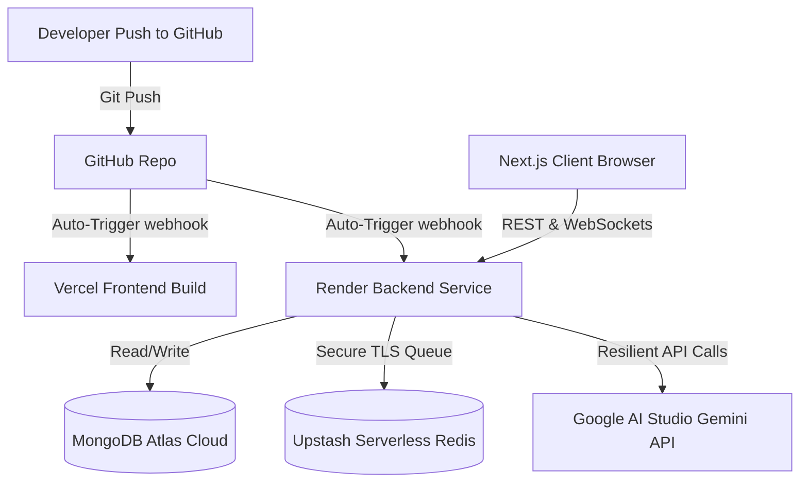

# 🚀 EduAi Cloud Deployment & Production Orchestration Guide

This document provides a comprehensive, production-grade guide to deploying **EduAi** to public cloud hosting environments. 

In this monorepo setup:
* **Frontend**: Hosted on **Vercel** (Serverless Next.js Static Optimization & App Router)
* **Backend**: Hosted on **Render** (Continuous deployment Web Service with persistent WebSocket connection support)
* **Task Queue**: Managed via **Upstash Redis** (Serverless, TLS-secured BullMQ pipeline)
* **Database**: Hosted on **MongoDB Atlas** (M0 Cloud DB Cluster)
* **AI Orchestration**: Powered by **Google Gemini API** (via Google GenAI SDK)

---

## 📐 Deployment Architecture & Flow



---

## 🛠️ Infrastructure Provisioning Checklist

Before deploying either service, you need to spin up the cloud data layers and obtain your API credentials:

### 1. MongoDB Atlas (Database Layer)
1. Register/Login to [MongoDB Atlas](https://www.mongodb.com/cloud/atlas).
2. Create a free **M0 Cluster** (select any region near your target audience).
3. Under **Database Access**, create a user with `Read and Write to any database` privileges.
4. Under **Network Access**, click **Add IP Address** and select **Allow Access from Anywhere** (`0.0.0.0/0`). 
   > [!IMPORTANT]
   > You **must** set the MongoDB whitelist to `0.0.0.0/0` because Render's free tier assigns dynamic IP addresses to web services that rotate on every deployment.
5. Copy your connection string: `mongodb+srv://<username>:<password>@cluster.mongodb.net/eduai?retryWrites=true&w=majority`.

### 2. Upstash Redis (Task Queue Layer)
1. Login to the [Upstash Console](https://console.upstash.com/).
2. Click **Create Database**. Name it `eduai-queue` and select a region closest to your Render server (e.g., N. Virginia or Frankfurt).
3. Scroll down to the **Details** section and look for the **TCP Endpoint** under connection info.
4. Copy the secure TLS endpoint URL (which starts with `rediss://`):
   `rediss://default:<password>@<host>.upstash.io:6379`
   > [!TIP]
   > EduAi uses standard TLS handshake to encrypt commands sent to Upstash Redis. Make sure to use the **`rediss://`** prefix (with double `s`) to enforce secure SSL, otherwise connection attempts will be aborted by Upstash's security rules.

### 3. Google Gemini (AI Layer)
1. Visit [Google AI Studio](https://aistudio.google.com/).
2. Click **Get API Key** and generate a new key.
3. Save the token securely.

---

## 📦 1. Backend Deployment (Render)

Render runs our persistent Express backend and accepts the real-time WebSocket protocol connections (`wss://`).

### Step-by-Step Render Setup
1. Log in to [Render Dashboard](https://dashboard.render.com).
2. Click **New +** and select **Web Service**.
3. Connect your GitHub account and select your `assessment_creater` repository.
4. Configure the Web Service settings:
   * **Name**: `eduai-backend` (or a custom name)
   * **Region**: Select the region closest to your Redis/MongoDB setup (e.g., `Singapore` or `Oregon`).
   * **Branch**: `main`
   * **Root Directory**: `backend` (Crucial: pointing to the monorepo subfolder!)
   * **Language**: `Node`
5. Configure the build parameters:
   * **Build Command**: `npm install && npm run build`
   * **Start Command**: `npm start`
6. Click **Advanced** and add the following **Environment Variables**:

| Variable Name | Required? | Purpose & Example Value |
| :--- | :---: | :--- |
| `PORT` | Yes | `5000` (Render will auto-bind to this port) |
| `NODE_ENV` | Yes | `production` |
| `MONGODB_URI` | Yes | `mongodb+srv://...` (Your MongoDB Atlas connection URI) |
| `GEMINI_API_KEY` | Yes | `AIzaSy...` (Your Google Gemini API Key) |
| `REDIS_HOST` | Optional | `bright-boa-137718.upstash.io` (Upstash host name without protocol) |
| `REDIS_PORT` | Optional | `6379` |
| `REDIS_PASSWORD` | Optional | `gQAAAAAAAhn...` (Upstash password string) |

> [!NOTE]
> EduAi features a **High-Availability Queue Bypass**. If your Redis environment variables are omitted or invalid, the backend will automatically bypass BullMQ and run task processing asynchronously inline. This keeps 100% of generation features available even if Redis is offline!

7. Click **Create Web Service**. Render will now pull the code, install production dependencies, compile TypeScript into standard JS in `dist/`, and boot up the server.

---

## 🎨 2. Frontend Deployment (Vercel)

Vercel provides optimal static rendering and high performance for client-side Next.js frameworks.

### Step-by-Step Vercel Setup
1. Log in to [Vercel](https://vercel.com).
2. Click **Add New...** and select **Project**.
3. Import your `assessment_creater` GitHub repository.
4. On the Configuration screen, configure these settings:
   * **Framework Preset**: `Next.js`
   * **Root Directory**: Click *Edit* and select **`frontend`** (This directs Vercel to compile only the Next.js client within the monorepo).
5. Open the **Environment Variables** section and add the following single variable:

| Variable Name | Required? | Value |
| :--- | :---: | :--- |
| `NEXT_PUBLIC_API_URL` | Yes | `https://your-backend-service.onrender.com` (The live Render Web Service URL **without** a trailing slash) |

6. Click **Deploy**. Vercel will build the frontend, run the static optimization checks, and generate live pages!

---

## 🔍 Key Production Troubleshooting & Edge Cases Solved

Our deployment workflow addresses real-world, industry-standard edge cases to keep the application 100% resilient:

### 1. Next.js Static Prerender Suspense Bailout
* **The Issue**: Next.js automatically attempts to statically optimize client routes during the build process. If a component uses `useSearchParams()` (like the Settings tabs page `/settings`) outside a `<Suspense>` boundary, it causes a fatal build failure (`useSearchParams() should be wrapped in a suspense boundary...`).
* **The Fix**: The Settings page has been designed using a container architecture: hook logic is separated into `SettingsPageContent` and then wrapped inside a `<Suspense fallback={...}>` in the default export of `settings/page.tsx`. This guarantees that Vercel builds compile flawlessly.

### 2. Upstash SSL Connection Socket Abort
* **The Issue**: Upstash Redis only accepts secure SSL/TLS connections (`rediss://`). When a standard TCP connection is initiated, the server terminates it instantly.
* **The Fix**: EduAi's Redis client configuration dynamically evaluates the remote environment. If a remote host is detected, it automatically injects a secure `{}` TLS flag into the connection setup:
  ```typescript
  tls: process.env.REDIS_HOST && process.env.REDIS_HOST !== '127.0.0.1' ? {} : undefined
  ```

### 3. Production DevDependencies Compilation Error
* **The Issue**: Node hosting providers (like Render) prune `devDependencies` in production. If necessary type definitions (e.g. `@types/express`, `@types/ws`) or libraries (e.g. `cors`) are classified under devDependencies, the TypeScript compilation step (`tsc`) will fail.
* **The Fix**: All required package compilation typings are loaded under standard production `"dependencies"` in the backend `package.json`, ensuring clean building on any Node engine.

---

## 📋 Production Verification Flow

To verify that your deployment is fully operational:
1. Navigate to your live Vercel frontend URL.
2. Go to **Settings** and ensure you can switch between Light and Dark mode without lag.
3. Navigate to **Create Assignment**, choose tomorrow's date (the datepicker prevents past dates), choose any custom guidelines, and click **Generate**.
4. Monitor the status updates:
   * Behind the scenes, the frontend initiates a WebSocket connection to the Render URL using `wss://`.
   * The progress bar will tick through the real-time WebSocket ticks (`10%` to `100%`).
   * The generated printable document will render flawlessly in `/output` with beautiful Glowing Difficulty badges.
