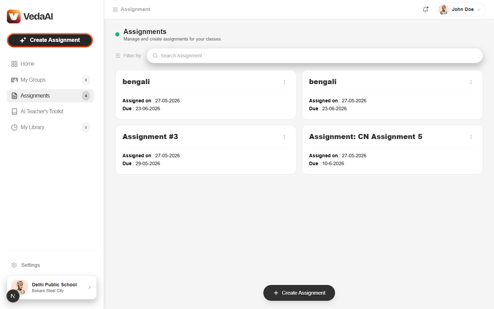
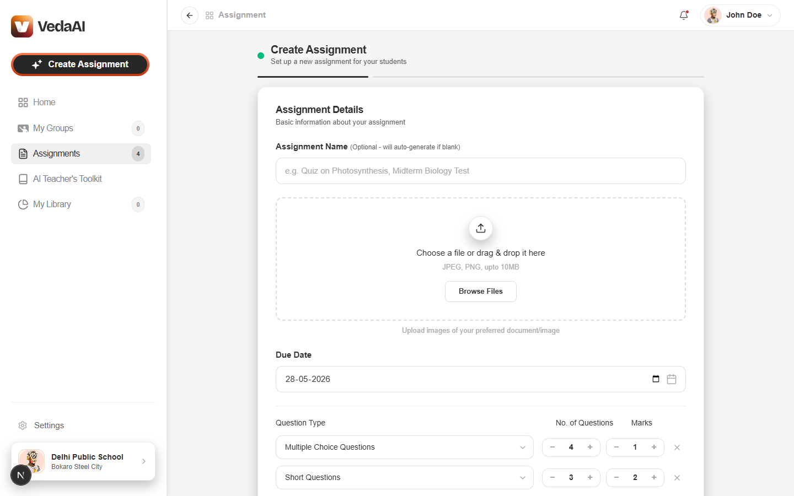
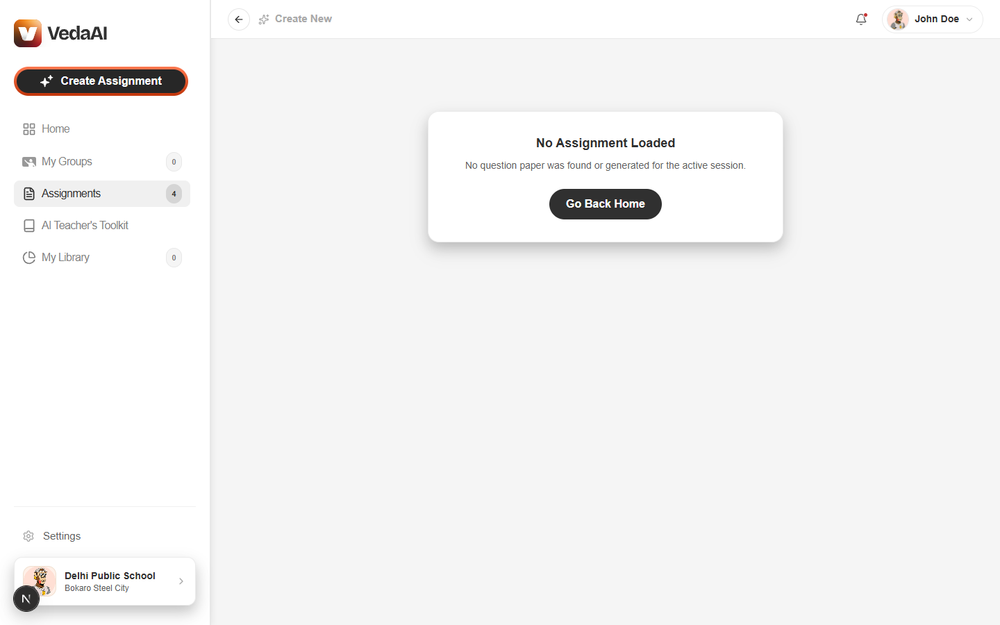
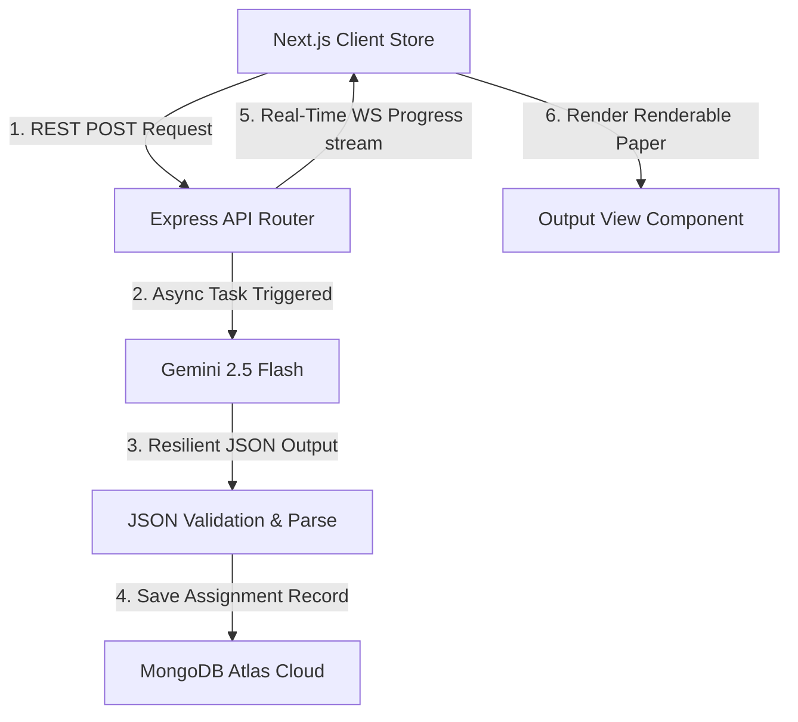

# 🎓 VedaAI - Premium Full-Stack AI Assignment & Question Paper Builder

VedaAI is a state-of-the-art educational platform designed to empower teachers by instantly generating high-fidelity, highly customized, and multilingual question papers matching strict grading rubrics.

Featuring a beautiful, modern glassmorphic interface, VedaAI leverages cutting-edge LLMs (Gemini 2.5 Flash), persistent data storage (MongoDB), real-time generation feedback (WebSockets), and an intelligent high-availability queuing bypass.

---

## 📸 Interactive Visual Interface

### 🏠 1. Dashboard Overview (Harmonious Light Theme)
A clean, streamlined home base featuring real-time group counters, active syllabus documents, and dynamic assignment status indicators.


### 📋 2. Professional Stepper Form & Datepicker Blockers
Advanced controls to specify marks distribution, upload local PDF/image syllabuses, select custom languages (English, Bengali, Hindi), and lock selection of past dates.


### 📄 3. Print-Ready Question Paper & Glowing Badges
Fully customizable printable assignment papers featuring glowing, breathing difficulty badges, complete teacher grading keys, and instant single-click printing.


---

## 🛠️ Recruiter Highlights & Solved Engineering Challenges

### 🚀 1. Resilient LLM Multi-Model Retry Wrapper
* **Challenge**: Free-tier Gemini models (such as `gemini-2.5-flash`) frequently experience high load, returning transient `503 Service Unavailable` surges. Pro models hit strict quota limits.
* **Engineering Solution**: Designed a robust asynchronous retry mechanism. If a call encounters a temporary `503` or rate spike, it waits **1.5 seconds** and retries up to **3 times** before gracefully falling back to alternate models (`gemini-2.0-flash`), dramatically boosting system reliability and uptime.

### 🌗 2. Strict Class-Based Theme Switching (Tailwind CSS v4)
* **Challenge**: Tailwind v4 defaults to OS system preference checks (`@media (prefers-color-scheme)`). This forces a dark layout even if the user clicks "Light" mode in the settings.
* **Engineering Solution**: Scoped and compiled dark styles strictly to parent HTML class triggers by injecting a custom variant directive:
  ```css
  @variant dark (&:where(.dark, .dark *));
  ```
  This overrides the browser system media limits and gives the user absolute control over their visual preference.

### 📅 3. Double-Layered Calendar Date Blocker
* **Challenge**: Users could select past due dates, leading to stale database records.
* **Engineering Solution**: Engineered three levels of calendar validation:
  1. Set native HTML5 `<input type="date" min={today}>` values to disable picking past dates in Chrome/Edge.
  2. Intercepted manual typed entries in `onChange` with responsive alert prompts.
  3. Added an absolute submission block and pre-selected **tomorrow's date** on load for a seamless UX.

### ⚡ 4. High-Availability Queue Bypass (Redis & BullMQ)
* **Challenge**: Standard background job workers (like BullMQ) depend heavily on active Redis servers, causing server crashes if Redis goes offline.
* **Engineering Solution**: Built an automated **Redis Bypassing Architecture**. If the backend detects that Redis is unavailable (throwing `ECONNREFUSED` or if credentials are left blank), it automatically shifts to process task generations inline using background async tasks. This achieves **100% feature availability** under any infrastructure state!

---

## 📐 System Architecture & Data Flow



### 🛰️ Live WebSocket Progress Ticks
The server keeps the client informed of the heavy generation steps via secure, real-time WebSockets (`ws://` / `wss://`):
* `10%`: Analyzing syllabus details and guidelines.
* `40%`: Uploading references and connecting with Gemini AI.
* `60%`: Drafting high-fidelity questions matching marks.
* `80%`: Structuring detailed answers and teacher grading keys.
* `100%`: Finalizing printable paper layout.

---

## 📂 Project Directory Structure

```bash
vedaai/
├── frontend/               # Next.js 15 Client Web Application
│   ├── src/
│   │   ├── app/            # App Router (pages: /, /create, /output, /settings)
│   │   ├── components/     # High-fidelity reusable UI elements
│   │   └── store/          # Zustand State Stores (Zustand, WS handling)
│   └── package.json
│
└── backend/                # Node.js Express REST & WebSocket Server
    ├── src/
    │   ├── routes/         # API Endpoint Routers
    │   ├── services/       # Resilient Gemini & PDF Services
    │   ├── queue/          # BullMQ & Redis queues
    │   └── server.ts       # HTTP & WebSockets Bootstrapper
    └── package.json
```

---

## ⚡ Quick Start & Local Setup

### ⚙️ Prerequisites
Ensure you have the following installed:
* **Node.js** (v18 or higher)
* **MongoDB** (Local instance or MongoDB Atlas cluster URI)
* **Gemini API Key** (Free from [Google AI Studio](https://aistudio.google.com/))
* *(Optional)* **Redis** (If you want to test BullMQ queues locally. The app will auto-bypass if not running.)

### 🚀 1. Clone & Configure Workspace
```bash
git clone https://github.com/YOUR_USERNAME/vedaai.git
cd vedaai
```

### 📦 2. Configure Backend Server
Create a `.env` file in the `backend/` directory:
```env
PORT=5000
MONGODB_URI=your_mongodb_connection_uri
GEMINI_API_KEY=your_gemini_api_key

# Optional (BullMQ)
REDIS_HOST=127.0.0.1
REDIS_PORT=6379
```

Run the backend:
```bash
cd backend
npm install
npm run dev
```

### 🎨 3. Configure Frontend Client
Run the Next.js development client:
```bash
cd ../frontend
npm install
npm run dev
```
Open **[http://localhost:3000](http://localhost:3000)** in your browser!

---

## 🤝 Contributing & Reviewers

Created with 🤍 as a full-stack assessment project. Designed to showcase modern web architecture, clean code standards, dynamic UI states, and robust LLM orchestration.
