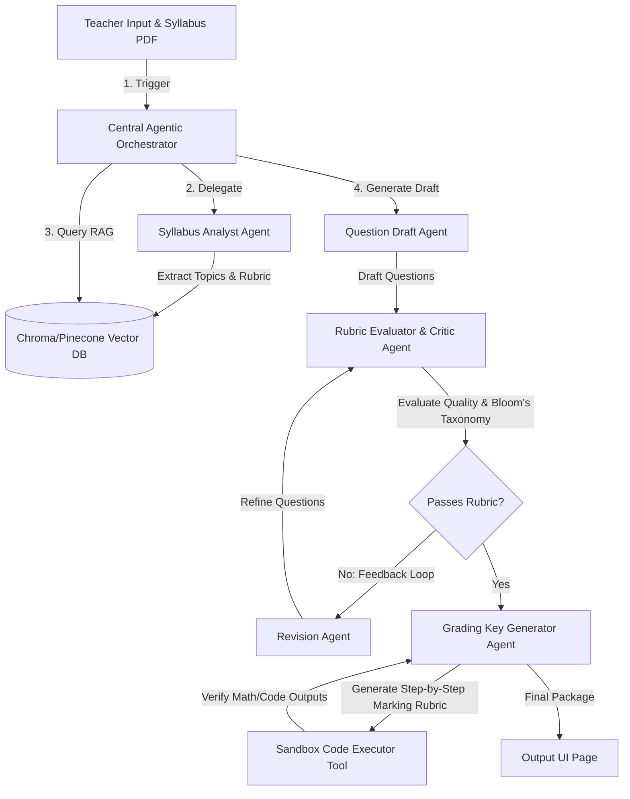

# 🚀 EduAi: Next-Level Agentic AI Architecture Roadmap

This document outlines a professional production-grade roadmap to transform **EduAi** from a single-prompt AI generator into an **Agentic AI Multi-Agent Orchestration Platform**. Implementing these features will showcase senior-level engineering maturity, systems design expertise, and state-of-the-art AI orchestration to tech recruiters.

---

## 📐 Proposed Agentic Architecture & Workflow

Rather than a single LLM request-response cycle, the system will utilize a **Cooperative Multi-Agent Loop** coordinated via a central orchestrator.

---

## 🧠 Phase 1: Cooperative Multi-Agent Core

We can define specialized agents using a framework like **LangGraph** or a custom lightweight state machine:

### 1. The Syllabus Analyst Agent
* **Role**: Parses uploaded text, PDFs, or images to build a structured knowledge graph of topics, key terms, and target learning outcomes.
* **Why it's unique**: Standard generators just dump the PDF text into a prompt. This agent extracts exact concept relationships, ensuring questions build on actual curriculum hierarchies.

### 2. The Question Generator Agent
* **Role**: Generates question drafts matched to specific marks, styles (MCQ, Short Answer, Essay), and cognitive levels.
* **Why it's unique**: It uses specialized prompting styles like **Chain-of-Thought (CoT)** to plan the structure of the questions before writing them.

### 3. The Critic & Rubric Evaluator Agent (Self-Reflection)
* **Role**: Acts as a peer reviewer. It grades the generated questions against:
  * **Bloom's Taxonomy** (Verifying if a "Hard" question actually tests critical synthesis, not just memory recall).
  * **Clarity & Ambiguity** (Checking if multiple choices in MCQs are distinct and clear).
  * **Language Accuracy**.
* **The Agentic Loop**: If the Critic Agent flags a question as sub-standard, it sends it back to a **Revision Agent** with detailed feedback (e.g. *"Question 3 is marked Hard but is a simple recall question. Make it require critical synthesis"*). The loop runs up to 3 times before finalizing.

---

## 🛠️ Phase 2: Tool Use & Sandboxed Verification (Function Calling)

Agents become highly autonomous when they can interact with the external world using tools:

### 1. Sandboxed Code/Math Solver Tool
* **The Problem**: LLMs are notoriously bad at arithmetic, logic, and verifying code outputs.
* **The Agentic Tool**: When generating mathematical or coding questions (e.g., Python/Java tests), the **Grading Key Agent** sends the code/math problem to a sandboxed Python runtime executor. The tool executes the code, captures the stdout/results, and feeds it back to the agent to confirm the grading key is **100% correct** before rendering.

### 2. Live Web Search & Fact-Checking Tool
* **The Tool**: Integrates a search API (e.g., Tavily or Serper) so the Critic Agent can verify real-world facts, dates, and historical events to prevent AI hallucination in humanities or science papers.

---

## 📂 Phase 3: Advanced RAG (Retrieval-Augmented Generation)

Instead of passing the entire syllabus text in the LLM context window (which increases token cost and dilutes prompt attention):
1. **Chunking & Embedding**: Chunk textbooks, question banks, and lecture slides, and store them as vector embeddings in a vector database (e.g., **Pinecone** or **ChromaDB**).
2. **Contextual Retrieval**: When a teacher asks for questions on "Photosynthesis", the system retrieves the most relevant 3-4 paragraphs from the textbook and inputs only those paragraphs as high-quality context to the Generator Agent.
3. **Why recruiters love this**: Shows you understand vector search, semantic embeddings, and context window optimization.

---

## 🖥️ Phase 4: UI/UX Real-Time Agentic Visualizer

A key way to **WOW recruiters** is to make the background agentic process visible on the frontend:
* **Interactive Stepper logs**: Replace the generic percentage progress loader with a live, real-time agent activity feed using WebSockets:
  * `[Syllabus Analyst Agent]` 🔍 *Analyzing 'Unit 4 Chemistry.pdf'... Found 5 core topics.*
  * `[Drafting Agent]` ✍️ *Drafting Section B (Short Answer questions)...*
  * `[Critic Agent]` 🛡️ *Evaluating draft... Flagged Question 4 (Difficulty mismatch).*
  * `[Revision Agent]` 🔄 *Refining Question 4 based on Critic feedback...*
  * `[Code Solver Tool]` 💻 *Executing Python code test cases... Output verified successfully.*
  * `[KeyGen Agent]` 📄 *Structuring final print-ready grading keys.*
* This gives a premium "AI-Agent-at-Work" feel, making the complex engineering behind the scenes visible.

---

## 🎓 Recruiter Pitch: How to present this on your Resume/Portfolio

When discussing this project in interviews or on your resume, structure your highlights like this:

> **"Built a High-Availability Multi-Agent AI Assessment Creator (EduAi)"**
> * Developed a resilient full-stack platform utilizing Next.js (Zustand, WebSockets) and Node/Express (BullMQ, MongoDB).
> * Engineered an **asynchronous multi-agent critique loop** allowing self-reflection: a Generator Agent drafts academic content, a Critic Agent reviews alignment with Bloom's Taxonomy, and a Revision Agent corrects low-performing questions before final export.
> * Implemented **graceful degradation (Redis Bypass Pipeline)** to intercept cache server failures, automatically switching to inline execution to guarantee 100% application uptime.
> * Developed sandboxed tool execution to programmatically verify code-execution outputs and logic gates in STEM question keys.
